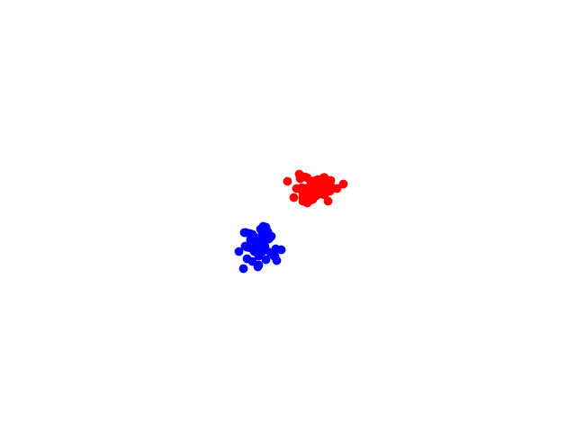

Simple diffusion network that uses laplacian for repulsion

The network diffusion without repulsion:

The network diffusion with repulsion:

In both cases, the diffusion is just random-normal. Maybe next step is adding gradient diffusion? Should be pretty straightforward...
